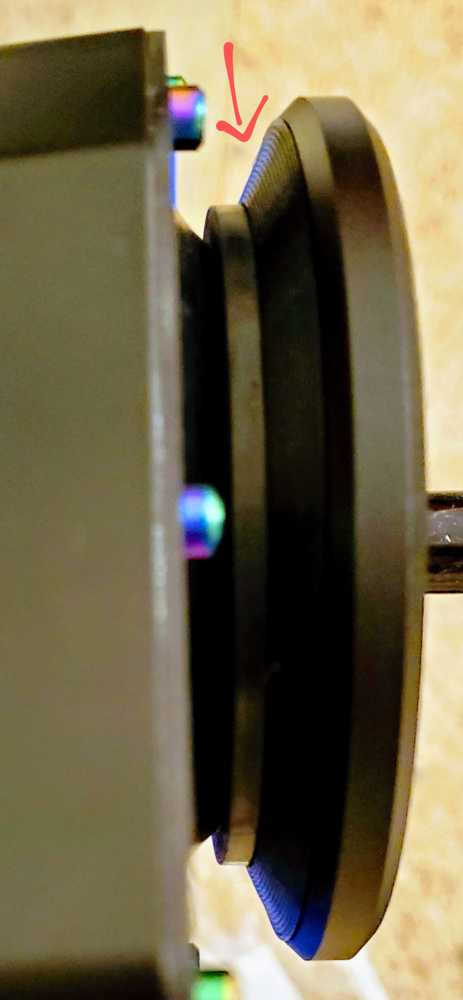
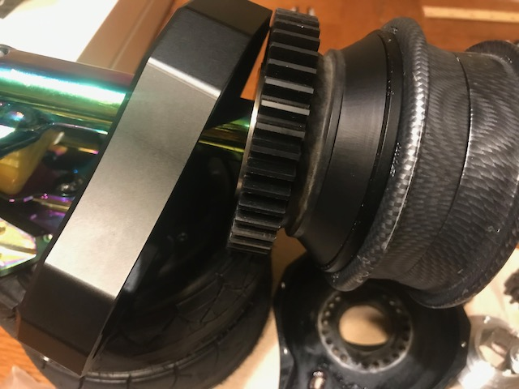
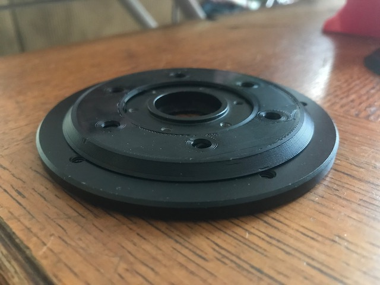
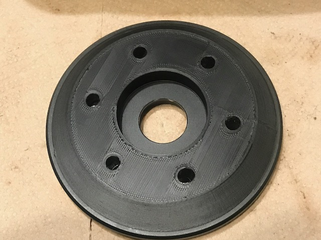
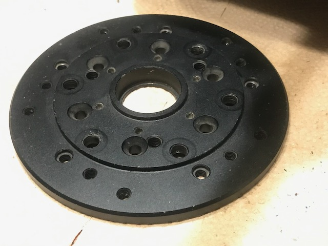

# Venom121212's spacer for moon gear drives and MBS trucks

A custom 3d printable one piece spacer for moon gear drives by [Venom21212](https://forum.esk8.news/u/venom121212/summary)

[Moon's gear drives](https://forum.esk8.news/t/260-all-terrain-moon-drive/7474)
require appropraite spacers between the wheel plate and the drives.  On MBS
trucks this spacing varies from truck to truck.  

[Venom121212](https://forum.esk8.news/u/venom121212/summary) designed a 
[custom 3d printable spacer](https://forum.esk8.news/t/260-all-terrain-moon-drive/7474/1421). 

> meant to replace the spacers you need to use due to mbs tolerance differences, not anything moon did.

> added benefit that it also keeps the V ring from slipping away from the case for any reason

[fessyfoo](https://forum.esk8.news/u/fessyfoo/summary) implemented a parametric
version in OpenSCAD as well as a batch1 version.  and generated a range of sizes.

STLs are available in the [STL subdirectory](./STL)

